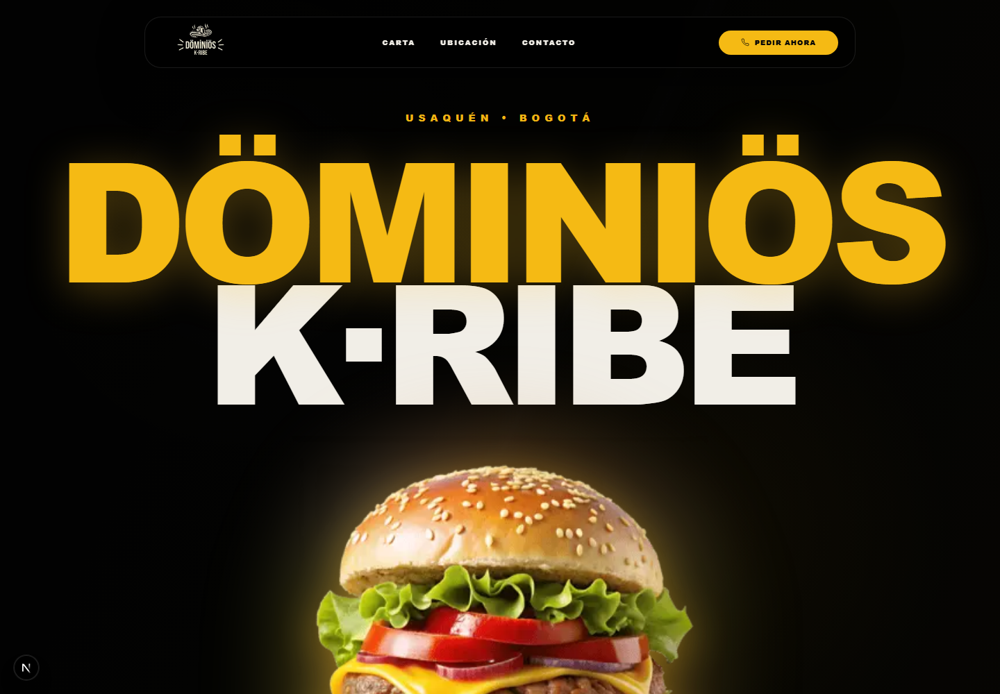

# Food Landing Template

Una plantilla moderna y completamente responsive para restaurantes, cafeterías, food trucks y cualquier negocio de comida. Incluye una marca de ejemplo para mostrar el resultado final, pero está pensada para que puedas reemplazar contenido, colores, imágenes y secciones con facilidad.



**Capturas completas:** [escritorio](public/screenshots/landing.png) · [móvil](public/screenshots/landing-mobile.png)

## Características

- Diseño responsive, optimizado para pantallas grandes y móviles.
- Hero de alto impacto, navegación adaptable y CTA fijo para pedidos.
- Carta interactiva con categorías y productos destacados.
- Secciones para experiencia de marca, ubicación, horarios y contacto.
- Metadatos SEO, Open Graph, datos estructurados de restaurante, `robots.txt` y sitemap.
- Páginas incluidas para privacidad, aviso legal y términos y condiciones.

## Empezar

Puedes usar el botón **Use this template** de GitHub o clonar el repositorio:

```bash
git clone https://github.com/URANOOB/FoodProject.git mi-restaurante
cd mi-restaurante
npm install
npm run dev
```

Abre [http://localhost:3000](http://localhost:3000) en el navegador.

### Requisitos

- Node.js 20 o superior
- npm 10 o superior

Este repositorio incluye `package-lock.json`; usa `npm` para conservar las versiones de dependencias previstas.

## Personalización rápida

Antes de publicar una copia de la plantilla, sustituye los datos de demostración de Döminiös K·Ribe por los de tu negocio.

| Qué cambiar | Dónde hacerlo |
| --- | --- |
| Nombre, URL, teléfono, correo, redes, dirección, horario y coordenadas | [`lib/constants.ts`](lib/constants.ts) |
| Título, descripción, enlaces de compra y la imagen principal | [`components/hero.tsx`](components/hero.tsx) |
| Categorías, productos, precios, descripciones e imágenes del menú | [`components/menu-section.tsx`](components/menu-section.tsx) |
| Navegación y CTA de pedido | [`components/header.tsx`](components/header.tsx) y [`components/sticky-cta.tsx`](components/sticky-cta.tsx) |
| Experiencia de marca, ubicación y contacto | `components/spot-section.tsx`, `components/location-section.tsx` y `components/contact-section.tsx` |
| Colores, tipografía y estilos globales | [`app/globals.css`](app/globals.css) |
| Logos, favicon, imagen social y recursos gráficos | [`public/graphics`](public/graphics) y [`public/og-image.webp`](public/og-image.webp) |
| Metadatos de la página y datos estructurados | [`app/layout.tsx`](app/layout.tsx) y [`app/page.tsx`](app/page.tsx) |
| Manifest, robots, sitemap y textos legales | `public/site.webmanifest`, `public/robots.txt`, `public/sitemap.xml` y `app/*` |

> Importante: no publiques la plantilla con el nombre, datos de contacto, URL, precios, ubicación, textos legales o imágenes del negocio de demostración.

## Estructura

```txt
app/                 # Rutas, metadata, páginas legales y composición principal
components/          # Secciones de la landing y componentes reutilizables
lib/constants.ts     # Configuración central de marca y contacto
public/graphics/     # Recursos visuales editables
public/screenshots/  # Referencias visuales de la plantilla
```

## Comandos

```bash
npm run dev    # Desarrollo local
npm run lint   # Revisión con ESLint
npm run build  # Build de producción
npm run start  # Ejecuta el build de producción localmente
```

## Publicar

Actualiza primero `SITE_CONFIG.url` en [`lib/constants.ts`](lib/constants.ts) y revisa las URL de `public/robots.txt`, `public/sitemap.xml` y `public/site.webmanifest`. Luego ejecuta:

```bash
npm run lint
npm run build
```

La plantilla puede desplegarse en cualquier plataforma compatible con Next.js, como Vercel, Netlify o un servidor Node.js.

## Licencia

Este repositorio se distribuye bajo la licencia ISC incluida en [`package.json`](package.json).
